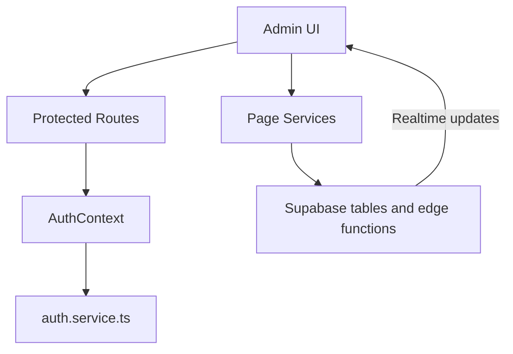

# Admin Panel Architecture

## Overview

The admin panel is a standalone React + Vite application for platform operators. It uses Supabase for authentication, data access, realtime subscriptions, and internal admin workflows.

## Core auth model

- Admins sign in with Supabase Auth.
- Access is granted only when the matching `public.accounts` row resolves to `role = 'admin'`.
- Route protection is handled in the app through `AuthContext` and protected routes.
- Admin auth bootstrap also guards against stale or invalid local sessions.

## Main data areas

- `accounts`: shared user identity and role information
- `owners`: owner verification and profile data
- `properties`: listing moderation and visibility controls
- `tickets`: support and issue workflows
- `settings`: admin-managed platform settings
- payments, refunds, settlements, and analytics tables used by finance workflows

## Application flow

## Important implementation notes

- The panel relies on Supabase role checks, not Firebase custom claims.
- Realtime refresh is handled with Supabase channel subscriptions where needed.
- Sensitive internal automation values should stay in Supabase Vault or edge-function secrets, not public tables.

## Cross-app impact

- Owner verification changes affect the owner app.
- Property moderation and listing visibility affect the customer app.
- Settings and finance operations can affect all three apps.
